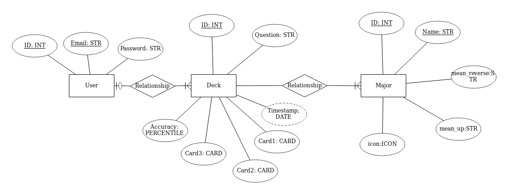

# In the cards - API

This is the back-end API for In the cards - a simple major arcana tarot card
reader. Please see the front end repository [here](https://github.com/TaraYoo/in-the-cards-client)
The front end is deployed [here](https://tarayoo.github.io/in-the-cards-client/#/)

## Dependencies (technologies used)

Install with `bundle install`.

-   [`rails-api`](https://github.com/rails-api/rails-api)
-   [`rails`](https://github.com/rails/rails)
-   [`active_model_serializers`](https://github.com/rails-api/active_model_serializers)
-   [`ruby`](https://www.ruby-lang.org/en/)
-   [`postgres`](http://www.postgresql.org)


## Planning
### ERD


### Routes

#### User Stories and related routes
##### I want to draw three cards
Draw three major arcana cards and assemble into a deck
1. /draw - 'GET' three cards at random from the deck
2. /deck - 'POST' post the deck of three cards to the user's account
  1. To 'post' to deck, user must sign in

##### I want to see my previous decks
See deck history, click a deck to see more details
1.  /deck - 'GET' get previous deck histories
1.  /deck/:id - 'GET' see details in one deck history

##### I want to note whether or not my reading was accurate
Update deck history to indicate reading's accuracy
1. /deck/:id - 'PATCH' update the deck's accuracy score

##### I want to delete previous readings
1. /deck/:id - 'DELETE' delete a particular deck


### Setup Environment:
1.  Install dependencies with `bundle install`.
1.  `git add` and `git commit` your changes.
1.  Create a `.env` for sensitive settings (`touch .env`).
1.  Generate new `development` and `test` secrets (`bundle exec rails secret`).
1.  Store them in `.env` with keys `SECRET_KEY_BASE_<DEVELOPMENT|TEST>`
    respectively.
1.  In order to make requests to your deployed API, you will need to set
    `SECRET_KEY_BASE` in the environment of the production API (for example, using `heroku config:set` or the Heroku dashboard).
1.  In order to make requests from your deployed client application, you will
    need to set `CLIENT_ORIGIN` in the environment of the production API (for example, `heroku config:set CLIENT_ORIGIN=https://<github-username>.github.io`).
    See more about deploying to heroku [rails-heroku-setup-guide](https://git.generalassemb.ly/ga-wdi-boston/rails-heroku-setup-guide)

### Setup your database:
    - bin/rails db:drop (if it already exists)
    - bin/rails db:create
    - bin/rails db:migrate
    - bin/rails db:seed
    - bin/rails db:examples

  Note: Remember to follow the same commands when setting up your deployed database!

### Run your server!
1. Run the API server with `bin/rails server` or `bundle exec rails server`.

## Structure

This template follows the standard project structure in Rails.

`curl` command scripts are stored in [`curl-scripts`](curl-scripts) with names that
correspond to API actions.

User authentication was built-in by Boston General Assembly.

## Tasks

-   `bin/rails routes` lists the endpoints available in your API.
-   `bin/rspec spec` runs automated tests.
-   `bin/rails console` opens a REPL that pre-loads the API.
-   `bin/rails db` opens your database client and loads the correct database.
-   `bin/rails server` starts the API.
-   `curl-scripts/*.sh` run various `curl` commands to test the API. See below.

## Future to-dos
- Add minor arcana cards to the deck
- Trim down unused assets and routes
- Add AWS upload routes

## API

### Authentication

| Verb   | URI Pattern            | Controller#Action |
|--------|------------------------|-------------------|
| POST   | `/sign-up`             | `users#signup`    |
| POST   | `/sign-in`             | `users#signin`    |
| PATCH  | `/change-password`     | `users#changepw`  |
| DELETE | `/sign-out`            | `users#signout`   |

#### POST /sign-up

Request:

```sh
curl http://localhost:4741/sign-up \
  --include \
  --request POST \
  --header "Content-Type: application/json" \
  --data '{
    "credentials": {
      "email": "'"${EMAIL}"'",
      "password": "'"${PASSWORD}"'",
      "password_confirmation": "'"${PASSWORD}"'"
    }
  }'
```

```sh
EMAIL=ava@bob.com PASSWORD=hannah curl-scripts/auth/sign-up.sh
```

Response:

```md
HTTP/1.1 201 Created
Content-Type: application/json; charset=utf-8

{
  "user": {
    "id": 1,
    "email": "ava@bob.com"
  }
}
```

#### POST /sign-in

Request:

```sh
curl http://localhost:4741/sign-in \
  --include \
  --request POST \
  --header "Content-Type: application/json" \
  --data '{
    "credentials": {
      "email": "'"${EMAIL}"'",
      "password": "'"${PASSWORD}"'"
    }
  }'
```

```sh
EMAIL=ava@bob.com PASSWORD=hannah curl-scripts/auth/sign-in.sh
```

Response:

```md
HTTP/1.1 200 OK
Content-Type: application/json; charset=utf-8

{
  "user": {
    "id": 1,
    "email": "ava@bob.com",
    "token": "BAhJIiVlZDIwZTMzMzQzODg5NTBmYjZlNjRlZDZlNzYxYzU2ZAY6BkVG--7e7f77f974edcf5e4887b56918f34cd9fe293b9f"
  }
}
```

#### PATCH /change-password

Request:

```sh
curl --include --request PATCH "http://localhost:4741/change-password" \
  --header "Authorization: Token token=$TOKEN" \
  --header "Content-Type: application/json" \
  --data '{
    "passwords": {
      "old": "'"${OLDPW}"'",
      "new": "'"${NEWPW}"'"
    }
  }'
```

```sh
OLDPW='hannah' NEWPW='elle' TOKEN='BAhJIiVlZDIwZTMzMzQzODg5NTBmYjZlNjRlZDZlNzYxYzU2ZAY6BkVG--7e7f77f974edcf5e4887b56918f34cd9fe293b9f' sh curl-scripts/auth/change-password.sh
```

Response:

```md
HTTP/1.1 204 No Content
```

#### DELETE /sign-out

Request:

```sh
curl http://localhost:4741/sign-out \
  --include \
  --request DELETE \
  --header "Authorization: Token token=$TOKEN"
```

```sh
TOKEN='BAhJIiVlZDIwZTMzMzQzODg5NTBmYjZlNjRlZDZlNzYxYzU2ZAY6BkVG--7e7f77f974edcf5e4887b56918f34cd9fe293b9f' sh curl-scripts/auth/sign-out.sh
```

Response:

```md
HTTP/1.1 204 No Content
```
### Card

| Verb  | URI Pattern         | Controller#Action |
|-------|---------------------|---------------   -|
| GET   | `/draw`             | `card#draw`       |

#### GET /draw

Request:

```sh
curl "http://localhost:4741/draw" \
  --include \
  --request GET \

echo
```

Response:

```md
HTTP/1.1 200 OK
Content-Type: application/json; charset=utf-8
ETag: W/"079897a45d6835241c5a67097971f176"
Cache-Control: max-age=0, private, must-revalidate
X-Request-Id: ce15bb03-a0d7-454e-b7fb-b7b7ced060e0
X-Runtime: 0.221646
Vary: Origin
Transfer-Encoding: chunked

{"cards":[{"id":3,"name":"High Pristess","icon":"🧙‍♀️","mean_up":"Intuition, Unconsciousness, Inner voice","mean_reverse":"Lack of center, lost iner voice, repressed feelings","up":true},{"id":18,"name":"Star","icon":"⭐","mean_up":"Hope, faith, rejuvenation","mean_reverse":"Insecurity, discouragement, faithlessness","up":true},{"id":2,"name":"Magician","icon":"🧙‍♂️","mean_up":"Willpower, Desire, Creation, Manifestation","mean_reverse":"Trickery, Illusions, Out of touch","up":true}]}
```

### Deck

| Verb   | URI Pattern            | Controller#Action |
|--------|------------------------|-------------------|
| GET    | `/deck`                | `deck#index`      |
| GET    | `/deck/:id`            | `deck#show`       |
| PATCH  | `/deck/:id`            | `deck#update`     |
| DELETE | `/deck/:id`            | `deck#destroy`    |
| POST   | `/deck`                | `deck#create`     |

#### GET /deck
Request:

```sh
#!/bin/bash

curl "http://localhost:4741/decks" \
  --include \
  --request GET \
  --header "Authorization: Token token=${TOKEN}"

echo
```

Response:
```md
{"decks":[
{"id":143,
 "question":"Should I interview?",
 "accuracy":null,
 "formatted_cards":[
 {"id":6,"up":false,"name":"Hierophant","mean_up":"Tradition, Conformty, Morality","mean_reverse":"Rebellion, Subversiveness, New approaches","icon":"🙏"},
 {"id":11,"up":false,"name":"Wheel of Fortune","mean_up":"Change, cycle, inevitable fate","mean_reverse":"No control, clinging to control, bad luck","icon":"🎡"},
 {"id":3,"up":false,"name":"High Pristess","mean_up":"Intuition, Unconsciousness, Inner voice","mean_reverse":"Lack of center, lost iner voice, repressed feelings","icon":"🧙‍♀️"}],
 "reading_date":"2019-04-18",
 "updated_on":"2019-04-18"}
]}
```

#### GET /deck/:id
Request:
```sh
#!/bin/bash

curl "http://localhost:4741/decks/${ID}" \
  --include \
  --request GET \
  --header "Authorization: Token token=${TOKEN}"

echo
```

Response:
```md
{"deck":
{"id":143,
 "question":"Should I interview?",
 "accuracy":null,
 "formatted_cards":[
 {"id":6,"up":false,"name":"Hierophant","mean_up":"Tradition, Conformty, Morality","mean_reverse":"Rebellion, Subversiveness, New approaches","icon":"🙏"},
 {"id":11,"up":false,"name":"Wheel of Fortune","mean_up":"Change, cycle, inevitable fate","mean_reverse":"No control, clinging to control, bad luck","icon":"🎡"},
 {"id":3,"up":false,"name":"High Pristess","mean_up":"Intuition, Unconsciousness, Inner voice","mean_reverse":"Lack of center, lost iner voice, repressed feelings","icon":"🧙‍♀️"}],
 "reading_date":"2019-04-18",
 "updated_on":"2019-04-18"}}
```

#### PATCH /deck/:id
Request:
```sh
#!/bin/bash

curl "http://localhost:4741/decks/${ID}" \
  --include \
  --request PATCH \
  --header "Content-Type: application/json" \
  --header "Authorization: Token token=${TOKEN}" \
  --data '{
    "deck": {
      "accuracy": "'"${ACCURACY}"'"
    }
  }'

echo
```

Response:
```md
HTTP/1.1 200 OK
Content-Type: application/json; charset=utf-8
ETag: W/"721667cf7b7f9afcac4c1d4e2cd9c0d6"
Cache-Control: max-age=0, private, must-revalidate
X-Request-Id: 7c4eaf65-bfe2-4477-a33c-d5801e73c40d
X-Runtime: 0.035415
Vary: Origin
Transfer-Encoding: chunked

{"deck":{"id":143,"question":"Should I interview?",

"accuracy":"4.0",

"formatted_cards":[
{"id":6,"up":false,"name":"Hierophant","mean_up":"Tradition, Conformty, Morality","mean_reverse":"Rebellion, Subversiveness, New approaches","icon":"🙏"},
{"id":11,"up":false,"name":"Wheel of Fortune","mean_up":"Change, cycle, inevitable fate","mean_reverse":"No control, clinging to control, bad luck","icon":"🎡"},
{"id":3,"up":false,"name":"High Pristess","mean_up":"Intuition, Unconsciousness, Inner voice","mean_reverse":"Lack of center, lost iner voice, repressed feelings","icon":"🧙‍♀️"}],
"reading_date":"2019-04-18",
"updated_on":"2019-04-18"}}
```

#### POST /deck
POST deck draws three random cards from the Card.
Each of the three card creates a join table Reading - which connects the deck
with three cards.

Request:
```sh
#!/bin/bash

curl "http://localhost:4741/decks/${ID}" \
  --include \
  --request PATCH \
  --header "Content-Type: application/json" \
  --header "Authorization: Token token=${TOKEN}" \
  --data '{
    "deck": {
      "accuracy": "'"${ACCURACY}"'"
    }
  }'

echo
```

Response:
```md
HTTP/1.1 201 Created
Location: http://localhost:4741/decks/146
Content-Type: application/json; charset=utf-8
ETag: W/"50f2f39f2c7c029628b0574a937824af"
Cache-Control: max-age=0, private, must-revalidate
X-Request-Id: 22ad94e7-7e41-470a-bbbe-c321a2922015
X-Runtime: 0.037248
Vary: Origin
Transfer-Encoding: chunked

{"deck":{"id":146,"question":"should I get a dog?","accuracy":null,
"formatted_cards":[
{"id":15,"up":false,"name":"Temperance","mean_up":"Middle path, patience, finding meaning","mean_reverse":"Extreme, Excess, imbalanced","icon":"💁"},
{"id":2,"up":true,"name":"Magician","mean_up":"Willpower, Desire, Creation, Manifestation","mean_reverse":"Trickery, Illusions, Out of touch","icon":"🧙‍♂️"},
{"id":19,"up":true,"name":"Moon","mean_up":"Unconscious, illusions, intuition","mean_reverse":"Confusion, fear, misinterpretation","icon":"🌝"}],
"reading_date":"2019-04-18",
"updated_on":"2019-04-18"}}

```
#### DELETE /deck/:id
Request:
```sh
#!/bin/bash

curl "http://localhost:4741/decks/${ID}" \
  --include \
  --request DELETE \
  --header "Content-Type: application/json" \
  --header "Authorization: Token token=${TOKEN}"

echo
```

Reponse:
```md
HTTP/1.1 204 No Content
Cache-Control: no-cache
X-Request-Id: 9c010bfc-5eaf-490b-ac4f-5aab691df708
X-Runtime: 0.018340
Vary: Origin
```

### Reset Database without dropping

This is not a task developers should run often, but it is sometimes necessary.

**locally**

```sh
bin/rails db:migrate VERSION=0
bin/rails db:migrate db:seed db:examples
```

**heroku**

```sh
heroku run rails db:migrate VERSION=0
heroku run rails db:migrate db:seed db:examples
```
