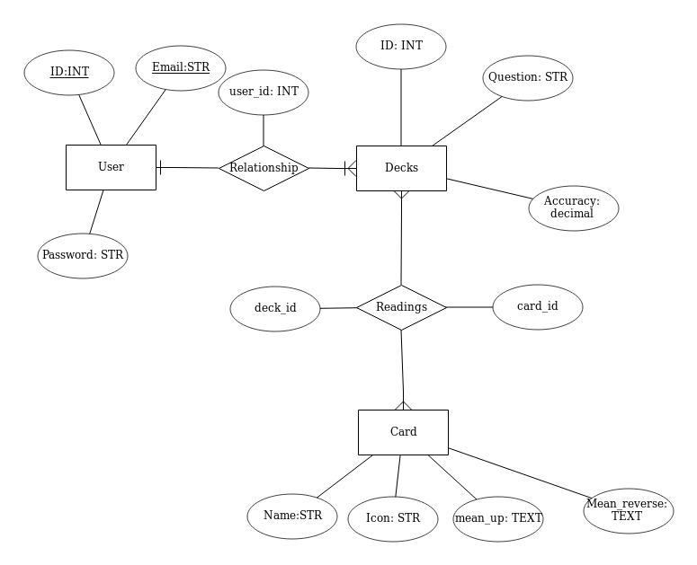

# In the cards - API

This is the back-end API for In the cards - a simple major arcana tarot card
reader. Please see the front end repository [here](https://github.com/TaraYoo/in-the-cards-client)
The front end is deployed [here](https://tarayoo.github.io/in-the-cards-client/#/)

## Dependencies (technologies used)

Install with `bundle install`.

-   [`rails-api`](https://github.com/rails-api/rails-api)
-   [`rails`](https://github.com/rails/rails)
-   [`active_model_serializers`](https://github.com/rails-api/active_model_serializers)
-   [`ruby`](https://www.ruby-lang.org/en/)
-   [`postgres`](http://www.postgresql.org)


## Planning
### ERD


### Routes

#### User Stories and related routes
##### I want to draw three cards
Draw three major arcana cards and assemble into a deck
1. /draw - 'GET' three cards at random from the deck
2. /deck - 'POST' post the deck of three cards to the user's account
  1. To 'post' to deck, user must sign in

##### I want to see my previous decks
See deck history, click a deck to see more details
1.  /deck - 'GET' get previous deck histories
1.  /deck/:id - 'GET' see details in one deck history

##### I want to note whether or not my reading was accurate
Update deck history to indicate reading's accuracy
1. /deck/:id - 'PATCH' update the deck's accuracy score

##### I want to delete previous readings
1. /deck/:id - 'DELETE' delete a particular deck

## Setup and installation

### Setup Environment:
1.  `bundle install`.
1.  `git add` and `git commit` changes.
1.  Create a `.env` for sensitive settings (`touch .env`).
1.  Generate new `development` and `test` secrets (`bundle exec rails secret`).
1.  Store the below in `.env`:
 - `SECRET_KEY_BASE_DEVELOPMENT=replace_with_the_first_secret_number_that_got_generated`
 `SECRET_KEY_BASE_TEST=replace_with_the_second_secret_number_that_got_generated`
1.  You will need to set separate secret keys if you want to deploy.

### Setup database:
    - bin/rails db:drop
    - bin/rails db:create
    - bin/rails db:migrate
    - bin/rails db:seed
    - bin/rails db:examples

You will need to repeat the above steps on deployment

### Run server!
1. Run `bin/rails server` or `bundle exec rails server` in your command line.

## Structure

This template follows the standard project structure in Rails.

`curl` command scripts are stored in [`curl-scripts`](curl-scripts) with names that
correspond to API actions.

User authentication was built-in by Boston General Assembly.

## Tasks

-   `bin/rails routes` lists the endpoints available in your API.
-   `bin/rspec spec` runs automated tests.
-   `bin/rails console` opens a REPL that pre-loads the API.
-   `bin/rails db` opens your database client and loads the correct database.
-   `bin/rails server` starts the API.
-   `curl-scripts/*.sh` run various `curl` commands to test the API. See below.

## Future to-dos
- Add minor arcana cards to the deck
- Trim down unused assets and routes
- Add AWS upload routes

## API

### Authentication

| Verb   | URI Pattern            | Controller#Action |
|--------|------------------------|-------------------|
| POST   | `/sign-up`             | `users#signup`    |
| POST   | `/sign-in`             | `users#signin`    |
| PATCH  | `/change-password`     | `users#changepw`  |
| DELETE | `/sign-out`            | `users#signout`   |

#### POST /sign-up

Request:

```sh
curl http://localhost:4741/sign-up \
  --include \
  --request POST \
  --header "Content-Type: application/json" \
  --data '{
    "credentials": {
      "email": "'"${EMAIL}"'",
      "password": "'"${PASSWORD}"'",
      "password_confirmation": "'"${PASSWORD}"'"
    }
  }'
```

```sh
EMAIL=ava@bob.com PASSWORD=hannah curl-scripts/auth/sign-up.sh
```

Response:

```md
HTTP/1.1 201 Created
Content-Type: application/json; charset=utf-8

{
  "user": {
    "id": 1,
    "email": "ava@bob.com"
  }
}
```

#### POST /sign-in

Request:

```sh
curl http://localhost:4741/sign-in \
  --include \
  --request POST \
  --header "Content-Type: application/json" \
  --data '{
    "credentials": {
      "email": "'"${EMAIL}"'",
      "password": "'"${PASSWORD}"'"
    }
  }'
```

```sh
EMAIL=ava@bob.com PASSWORD=hannah curl-scripts/auth/sign-in.sh
```

Response:

```md
HTTP/1.1 200 OK
Content-Type: application/json; charset=utf-8

{
  "user": {
    "id": 1,
    "email": "ava@bob.com",
    "token": "BAhJIiVlZDIwZTMzMzQzODg5NTBmYjZlNjRlZDZlNzYxYzU2ZAY6BkVG--7e7f77f974edcf5e4887b56918f34cd9fe293b9f"
  }
}
```

#### PATCH /change-password

Request:

```sh
curl --include --request PATCH "http://localhost:4741/change-password" \
  --header "Authorization: Token token=$TOKEN" \
  --header "Content-Type: application/json" \
  --data '{
    "passwords": {
      "old": "'"${OLDPW}"'",
      "new": "'"${NEWPW}"'"
    }
  }'
```

```sh
OLDPW='hannah' NEWPW='elle' TOKEN='BAhJIiVlZDIwZTMzMzQzODg5NTBmYjZlNjRlZDZlNzYxYzU2ZAY6BkVG--7e7f77f974edcf5e4887b56918f34cd9fe293b9f' sh curl-scripts/auth/change-password.sh
```

Response:

```md
HTTP/1.1 204 No Content
```

#### DELETE /sign-out

Request:

```sh
curl http://localhost:4741/sign-out \
  --include \
  --request DELETE \
  --header "Authorization: Token token=$TOKEN"
```

```sh
TOKEN='BAhJIiVlZDIwZTMzMzQzODg5NTBmYjZlNjRlZDZlNzYxYzU2ZAY6BkVG--7e7f77f974edcf5e4887b56918f34cd9fe293b9f' sh curl-scripts/auth/sign-out.sh
```

Response:

```md
HTTP/1.1 204 No Content
```
### Card

| Verb  | URI Pattern         | Controller#Action |
|-------|---------------------|---------------   -|
| GET   | `/draw`             | `card#draw`       |
| GET   | `/cards`            | `card#index`      |
| GET   | `/cards/:id`        | `card#show`       |

#### GET /draw

Request:

```sh
curl "http://localhost:4741/draw" \
  --include \
  --request GET \

echo
```

Response:

```md
HTTP/1.1 200 OK
Content-Type: application/json; charset=utf-8
ETag: W/"079897a45d6835241c5a67097971f176"
Cache-Control: max-age=0, private, must-revalidate
X-Request-Id: ce15bb03-a0d7-454e-b7fb-b7b7ced060e0
X-Runtime: 0.221646
Vary: Origin
Transfer-Encoding: chunked

{"cards":[
{"id":13,"name":"Hanged Man","mean_up":"Sacrifice, release, martyrdom","mean_reverse":"Stalling, Needless sacrifice, fear of sacrifice","up":false},
{"id":21,"name":"Judgement","mean_up":"reflection, reckoning, awakening","mean_reverse":"No self awareness, doubt, self loathing","up":false},
{"id":14,"name":"Death","mean_up":"End of a cycle, Change","mean_reverse":"Stagnation, fear of change, holding on","up":false}]}
```

#### GET /cards

Request:

```sh
curl "http://localhost:4741/cards" \
  --include \
  --request GET \

echo
```

Response:

```md
HTTP/1.1 200 OK
Content-Type: application/json; charset=utf-8
ETag: W/"1bd5b5b14a3aed15066b09c31ef7ac0a"
Cache-Control: max-age=0, private, must-revalidate
X-Request-Id: 31f1ced9-111d-4648-8936-4483e6775b0f
X-Runtime: 0.041075
Vary: Origin
Transfer-Encoding: chunked

{"cards":[{"id":1,"name":"Fool","mean_up":"Innocence, New Beginnings, Free Spirit","mean_reverse":"Recklessness, Taken Advantage of, Inconsiderate","up":true},{"id":2,"name":"Magician","mean_up":"Willpower, Desire, Creation, Manifestation","mean_reverse":"Trickery, Illusions, Out of touch","up":true},{"id":3,"name":"High Pristess","mean_up":"Intuition, Unconsciousness, Inner voice","mean_reverse":"Lack of center, lost iner voice, repressed feelings","up":false},{"id":4,"name":"Emperess","mean_up":"Motherhood, fertility, nature","mean_reverse":"Dependence, smothering, lack of self-reliance","up":true},{"id":5,"name":"Emperor","mean_up":"Authority, structure, control, fatherhood","mean_reverse":"Tyranny, rigidity, coldness","up":false},{"id":6,"name":"Hierophant","mean_up":"Tradition, Conformity, Morality","mean_reverse":"Rebellion, Subversiveness, New approaches","up":false},{"id":7,"name":"Lovers","mean_up":"Union, Duality","mean_reverse":"Loss of Balance, One-sidedness, disharmony","up":false},{"id":8,"name":"Chariot","mean_up":"Direction, control, willpower","mean_reverse":"Lack of control / direction, aggression","up":false},{"id":9,"name":"Justice","mean_up":"Cause and effect, clarity, truth","mean_reverse":"Dishonesty, Unaccountability, Unfairness","up":false},{"id":10,"name":"Hermit","mean_up":"Contemplation, Search for truth, Inner guidance","mean_reverse":"Loneliness, Isolation, Lost your way","up":true},{"id":11,"name":"Wheel of Fortune","mean_up":"Change, cycle, inevitable fate","mean_reverse":"No control, clinging to control, bad luck","up":true},{"id":12,"name":"Strength","mean_up":"Bravery, compassion, focus, inner strength","mean_reverse":"Self doubt, weakness, insecurity","up":true},{"id":13,"name":"Hanged Man","mean_up":"Sacrifice, release, martyrdom","mean_reverse":"Stalling, Needless sacrifice, fear of sacrifice","up":true},{"id":14,"name":"Death","mean_up":"End of a cycle, Change","mean_reverse":"Stagnation, fear of change, holding on","up":true},{"id":15,"name":"Temperance","mean_up":"Middle path, patience, finding meaning","mean_reverse":"Extreme, Excess, imbalanced","up":true},{"id":16,"name":"Devil","mean_up":"Excess, materialism, playfulness","mean_reverse":"Freedom, release, restoring control","up":true},{"id":17,"name":"Tower","mean_up":"Sudden upheaval, broken pride, disaster","mean_reverse":"Disaster avoided or delayed, fear of suffering","up":false},{"id":18,"name":"Star","mean_up":"Hope, faith, rejuvenation","mean_reverse":"Insecurity, discouragement, faithlessness","up":true},{"id":19,"name":"Moon","mean_up":"Unconscious, illusions, intuition","mean_reverse":"Confusion, fear, misinterpretation","up":false},{"id":20,"name":"Sun","mean_up":"Joy, success, celebration","mean_reverse":"Negativity, Depression, Sadness","up":true},{"id":21,"name":"Judgement","mean_up":"reflection, reckoning, awakening","mean_reverse":"No self awareness, doubt, self loathing","up":false},{"id":22,"name":"World","mean_up":"Fulfillment, Harmony, Completion","mean_reverse":"Incomplete, Lack of closure, Emptiness","up":false}]}
```

#### GET /cards/:id

Request:

```sh
curl "http://localhost:4741/cards/${ID}" \
  --include \
  --request GET \

echo
```

Response:

```md
HTTP/1.1 200 OK
Content-Type: application/json; charset=utf-8
ETag: W/"622a9abb7b0005f941e01a2f29ca0961"
Cache-Control: max-age=0, private, must-revalidate
X-Request-Id: 9547ea35-3fe6-40e5-90ab-badfa796a79e
X-Runtime: 0.008380
Vary: Origin
Transfer-Encoding: chunked

{"card":{"id":19,"name":"Moon","mean_up":"Unconscious, illusions, intuition","mean_reverse":"Confusion, fear, misinterpretation","up":true}}
```

### Deck

| Verb   | URI Pattern            | Controller#Action |
|--------|------------------------|-------------------|
| GET    | `/decks`                | `deck#index`      |
| GET    | `/decks/:id`            | `deck#show`       |
| PATCH  | `/decks/:id`            | `deck#update`     |
| DELETE | `/decks/:id`            | `deck#destroy`    |
| POST   | `/decks`                | `deck#create`     |

#### GET /deck
Request:

```sh
#!/bin/bash

curl "http://localhost:4741/decks" \
  --include \
  --request GET \
  --header "Authorization: Token token=${TOKEN}"

echo
```

Response:
```md
HTTP/1.1 200 OK
Content-Type: application/json; charset=utf-8
ETag: W/"f4375b34f68dc93b58bb39dfb4f52be2"
Cache-Control: max-age=0, private, must-revalidate
X-Request-Id: 5c2c57f3-82c1-4dec-b64e-0a8217d5aa4d
X-Runtime: 0.010645
Vary: Origin
Transfer-Encoding: chunked

{"decks":[
{"id":5,"question":"heeeere's Johnny","accuracy":null,
"formatted_cards":[
{"id":5,"up":true,"name":"Emperor","mean_up":"Authority, structure, control, fatherhood","mean_reverse":"Tyranny, rigidity, coldness"},
{"id":10,"up":false,"name":"Hermit","mean_up":"Contemplation, Search for truth, Inner guidance","mean_reverse":"Loneliness, Isolation, Lost your way"},
{"id":19,"up":false,"name":"Moon","mean_up":"Unconscious, illusions, intuition","mean_reverse":"Confusion, fear, misinterpretation"}],
"reading_date":"2019-04-20","updated_on":"2019-04-20"},
{"id":4,"question":"Question","accuracy":null,
"formatted_cards":[
{"id":21,"up":false,"name":"Judgement","mean_up":"reflection, reckoning, awakening","mean_reverse":"No self awareness, doubt, self loathing"},
{"id":12,"up":true,"name":"Strength","mean_up":"Bravery, compassion, focus, inner strength","mean_reverse":"Self doubt, weakness, insecurity"},
{"id":3,"up":true,"name":"High Pristess","mean_up":"Intuition, Unconsciousness, Inner voice","mean_reverse":"Lack of center, lost iner voice, repressed feelings"}],
"reading_date":"2019-04-20","updated_on":"2019-04-20"}]}

```

#### GET /deck/:id
Request:
```sh
#!/bin/bash

curl "http://localhost:4741/decks/${ID}" \
  --include \
  --request GET \
  --header "Authorization: Token token=${TOKEN}"

echo
```

Response:
```md
HTTP/1.1 200 OK
Content-Type: application/json; charset=utf-8
ETag: W/"d49a28c7a296b57e5c77a3f49f80bee3"
Cache-Control: max-age=0, private, must-revalidate
X-Request-Id: 68d2c11e-3926-4dad-83a6-01f4819cf521
X-Runtime: 0.007438
Vary: Origin
Transfer-Encoding: chunked

{"deck":
{"id":5,"question":"heeeere's Johnny","accuracy":null,
"formatted_cards":[
{"id":5,"up":true,"name":"Emperor","mean_up":"Authority, structure, control, fatherhood","mean_reverse":"Tyranny, rigidity, coldness"},
{"id":10,"up":false,"name":"Hermit","mean_up":"Contemplation, Search for truth, Inner guidance","mean_reverse":"Loneliness, Isolation, Lost your way"},
{"id":19,"up":false,"name":"Moon","mean_up":"Unconscious, illusions, intuition","mean_reverse":"Confusion, fear, misinterpretation"}],
"reading_date":"2019-04-20","updated_on":"2019-04-20"}}
```

#### PATCH /deck/:id
Request:
```sh
#!/bin/bash

curl "http://localhost:4741/decks/${ID}" \
  --include \
  --request PATCH \
  --header "Content-Type: application/json" \
  --header "Authorization: Token token=${TOKEN}" \
  --data '{
    "deck": {
      "accuracy": "'"${ACCURACY}"'"
    }
  }'

echo
```

Response:
```md
HTTP/1.1 200 OK
Content-Type: application/json; charset=utf-8
ETag: W/"2d4a441b4a38bfa51a994cedf3e3abef"
Cache-Control: max-age=0, private, must-revalidate
X-Request-Id: 5aff3cdc-c0f9-4342-8c2a-d76231f38315
X-Runtime: 0.014590
Vary: Origin
Transfer-Encoding: chunked

{"deck":{"id":5,"question":"heeeere's Johnny",

"accuracy":"3.0",

"formatted_cards":[
{"id":5,"up":true,"name":"Emperor","mean_up":"Authority, structure, control, fatherhood","mean_reverse":"Tyranny, rigidity, coldness"},
{"id":10,"up":false,"name":"Hermit","mean_up":"Contemplation, Search for truth, Inner guidance","mean_reverse":"Loneliness, Isolation, Lost your way"},
{"id":19,"up":false,"name":"Moon","mean_up":"Unconscious, illusions, intuition","mean_reverse":"Confusion, fear, misinterpretation"}],
"reading_date":"2019-04-20","updated_on":"2019-04-20"}}
```

#### POST /deck
POST deck draws three random cards from the Card.
Each of the three card creates a join table Reading - which connects the deck
with three cards.

Request:
```sh
#!/bin/bash

curl "http://localhost:4741/decks" \
  --include \
  --request POST \
  --header "Content-Type: application/json" \
  --header "Authorization: Token token=${TOKEN}" \
  --data '{
    "deck": {
      "question": "'"${QUESTION}"'"
    }
  }'

echo
```

Response:
```md
HTTP/1.1 201 Created
Location: http://localhost:4741/decks/6
Content-Type: application/json; charset=utf-8
ETag: W/"3081174614484b679d195ee9f443243e"
Cache-Control: max-age=0, private, must-revalidate
X-Request-Id: 2a8f4b54-fc8e-4b85-bdac-e4bc7d32a694
X-Runtime: 0.033902
Vary: Origin
Transfer-Encoding: chunked

{"deck":{"id":6,"question":"should I get a dog","accuracy":null,
"formatted_cards":[
{"id":8,"up":false,"name":"Chariot","mean_up":"Direction, control, willpower","mean_reverse":"Lack of control / direction, aggression"},
{"id":10,"up":false,"name":"Hermit","mean_up":"Contemplation, Search for truth, Inner guidance","mean_reverse":"Loneliness, Isolation, Lost your way"},
{"id":18,"up":true,"name":"Star","mean_up":"Hope, faith, rejuvenation","mean_reverse":"Insecurity, discouragement, faithlessness"}],
"reading_date":"2019-04-20","updated_on":"2019-04-20"}}
```

#### DELETE /deck/:id
Request:
```sh
#!/bin/bash

curl "http://localhost:4741/decks/${ID}" \
  --include \
  --request DELETE \
  --header "Content-Type: application/json" \
  --header "Authorization: Token token=${TOKEN}"

echo
```

Reponse:
```md
HTTP/1.1 204 No Content
Cache-Control: no-cache
X-Request-Id: 9c010bfc-5eaf-490b-ac4f-5aab691df708
X-Runtime: 0.018340
Vary: Origin
```

### Reset Database without dropping

This is not a task developers should run often, but it is sometimes necessary.

**locally**

```sh
bin/rails db:migrate VERSION=0
bin/rails db:migrate db:seed db:examples
```

**heroku**

```sh
heroku run rails db:migrate VERSION=0
heroku run rails db:migrate db:seed db:examples
```
